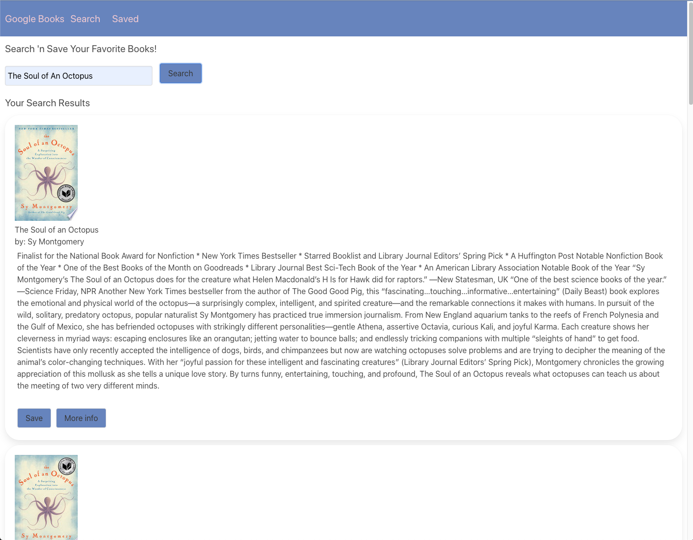

# Google Books Search 

This is a full MERN Stack application where a user can go in and search a book that they like and save their books. 

## How to Use

Download the repository to your local computer and npm install all of the required packages. Run `npm start` in your terminal and you be automatically redirected to a new page where you will be able to search for your book. 

## Technologies Used

- MongoDB / Mongoose
- Express.js 
- React.js
- Node.js