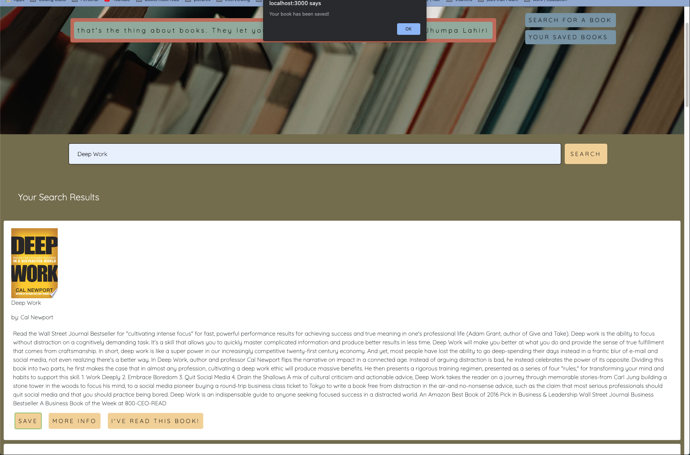

# Google Books Search 

This is a full MERN Stack application where a user can go in and search a book that they like and save their books. 

## Deployed Link

https://googlebookscsl.herokuapp.com/

## How to Use

Download the repository to your local computer and npm install all of the required packages. Run `npm start` in your terminal and you be automatically redirected to a new page where you will be able to search for your book. 

The first screen you see when you upload this MERN application. If you hit refresh, a new book quote will appear. 

This shows a book being searched

 Alert that tells user that their book has been successfully saved

 User can click on the 'saved' tab and find their books there. Users can delete or google further on the book. 

## Technologies Used

- MongoDB / Mongoose
- Express.js
- React.js
- Node.js
- Axios 

## Future Developments 

- Create a 'I've Read this Book' section